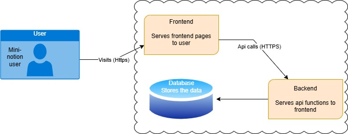

# Mini-Notion Development

## Conception phase

### Project description

**Mini-Notion** is a web application, based on the Notion [agenda](https://www.notion.so/), that has an user view, connected to a backend, in order to keep a state related to the tasks the user can schedule in this view. 

The **target groups** we can mention for this app are, individuals who require a simple and intuitive task and note management solution, such as students and professionals looking for an organized workspace to plan and track tasks and casual users needing lightweight productivity tools with easy accessibility. 

Some of the **benefits** the app provides, are a centralized workspace, allowing a productivity boost that enables users to create and manage notes while tracking tasks efficiently through different statuses. We can mention also the search functionality, which allows users to quickly locate stored notes and tasks, enhancing usability and convenience. All of these, backed by an optimized design that ensures a smooth user experience across devices. 

In the scope of **technologies**, for the frontend we will use **React** for dynamic and interactive user interface components and **Ant Design** for responsive design. For the backend, we will use **FastAPI** as a **Python** framework and **SQLite** as database to store the information.

### Diagram architecture flow

