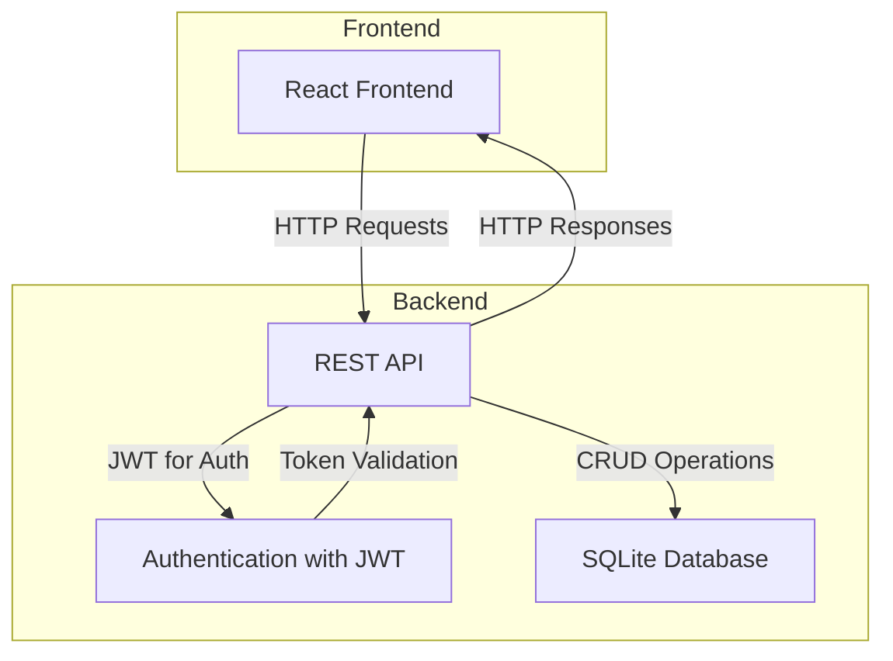

```mermaid
flowchart TB
    subgraph Frontend
        React[React Frontend]
    end

    subgraph Backend
        API[REST API]
        Auth[Authentication with JWT]
        Database[SQLite Database]
    end

    React -- "HTTP Requests" --> API
    API -- "CRUD Operations" --> Database
    API -- "JWT for Auth" --> Auth
    Auth -- "Token Validation" --> API
    API -- "HTTP Responses" --> React
```
